<div align="center">

#  Cardano PreProd Live Explorer

### Real-time blockchain explorer with Web3 wallet integration

[](https://blockchainliveexpolrer-production-af39.up.railway.app/)
[](https://www.rust-lang.org/)
[](https://nextjs.org/)
[](https://www.typescriptlang.org/)
[](https://cardano.org/)

**[Live Demo](https://blockchainliveexpolrer-production-af39.up.railway.app/)**  • **[Report Bug](https://github.com/kushal2060/Blockchain_live_expolrer/issues)**

---


</div>

---

## ✨ Features

<table>
  <tr>
    <td width="33%" align="center">
      <h3>⚡ Real-Time Streaming</h3>
      <p>Watch blocks and transactions as they happen on the blockchain with WebSocket connections</p>
    </td>
    <td width="33%" align="center">
      <h3> Wallet Integration</h3>
      <p>Connect your Cardano wallet securely with CIP-30 standard support for multiple wallets</p>
    </td>
    <td width="33%" align="center">
      <h3>Web3 Authentication</h3>
      <p>Sign in with your wallet using message signing - no passwords needed!</p>
    </td>
  </tr>
  <tr>
    <td width="33%" align="center">
      <h3> Rust Performance</h3>
      <p>High-performance backend built with Rust, Actix-web, and Oura pipeline</p>
    </td>

  </tr>
</table>

---

## 🌐 Live Deployment

| Service | URL |
|---------|-----|
| 🎨 **Frontend** | [blockchainliveexpolrer-production-af39.up.railway.app](https://blockchainliveexpolrer-production-af39.up.railway.app/) |
| 🔧 **Backend API** | [blockchainliveexpolrer-production-b895.up.railway.app](https://blockchainliveexpolrer-production-b895.up.railway.app/) |
| 📡 **WebSocket** | `wss://blockchainliveexpolrer-production-b895.up.railway.app/ws` |
| 🏥 **Health Check** | [Backend Health](https://blockchainliveexpolrer-production-b895.up.railway.app/health) |

---

## Tech Stack

### Backend Architecture


<table>
  <tr>
    <td><b>Language</b></td>
    <td>Rust </td>
  </tr>
  <tr>
    <td><b>Web Framework</b></td>
    <td>Actix-web 4.x</td>
  </tr>
  <tr>
    <td><b>Async Runtime</b></td>
    <td>Tokio</td>
  </tr>
  <tr>
    <td><b>Blockchain Data</b></td>
    <td>Oura v1.9 (txpipe)</td>
  </tr>
  <tr>
    <td><b>Authentication</b></td>
    <td>JWT + Ed25519 Signature Verification</td>
  </tr>
  <tr>
    <td><b>WebSocket</b></td>
    <td>actix-ws</td>
  </tr>
</table>

### Frontend Architecture

<table>
  <tr>
    <td><b>Framework</b></td>
    <td>Next.js 14 (App Router)</td>
  </tr>
  <tr>
    <td><b>Language</b></td>
    <td>TypeScript</td>
  </tr>
  <tr>
    <td><b>Styling</b></td>
    <td>Tailwind CSS 3.x</td>
  </tr>
  <tr>
    <td><b>Wallet Integration</b></td>
    <td>CIP-30 Standard</td>
  </tr>
  <tr>
    <td><b>State Management</b></td>
    <td>React Context API</td>
  </tr>
  <tr>
    <td><b>HTTP Client</b></td>
    <td>Native Fetch API</td>
  </tr>
</table>

---

## 🚀 Quick Start

### Prerequisites

```bash
# Rust & Cargo
curl --proto '=https' --tlsv1.2 -sSf https://sh.rustup.rs | sh

# Node.js & npm (v18+)
# Download from https://nodejs.org/

# Oura CLI
cargo install oura
```

###  Docker (Recommended)

The easiest way to run the entire stack:

```bash
# Clone the repository
git clone https://github.com/kushal2060/Blockchain_live_expolrer.git
cd cardano-explorer

# Start everything with Docker Compose
docker-compose up --build

# Access the application
# Frontend: http://localhost:3000
# Backend:  http://localhost:8000
# WebSocket: ws://localhost:8000/ws
```

### 🔧 Manual Setup

<details>
<summary><b> Backend Setup</b></summary>

```bash
# Navigate to backend directory
cd backend

# Install Oura
cargo install oura

# Verify Oura installation
oura --version

# Build the project
cargo build --release

# Run the backend
cargo run

# Backend will start on http://localhost:8000
```

**Environment Variables** (`.env`):
```env
RUST_LOG=info
JWT_SECRET=your-super-secret-jwt-key-change-in-production
SERVER_HOST=127.0.0.1
SERVER_PORT=8000
```

</details>

<details>
<summary><b> Frontend Setup</b></summary>

```bash
# Navigate to frontend directory
cd frontend

# Install dependencies
npm install

# Create environment file
cat > .env.local << EOF
NEXT_PUBLIC_API_URL=http://localhost:8000
NEXT_PUBLIC_WS_URL=ws://localhost:8000/ws
EOF

# Run development server
npm run dev

# Frontend will start on http://localhost:3000
```

**Build for Production:**
```bash
npm run build
npm run start
```

</details>

---

##  Wallet Integration

### Supported Wallets

<div align="center">

| Wallet | Website | Status |
|--------|---------|--------|
|  **Lace** | [lace.io](https://lace.io) | Recommended |
|  **Eternl** | [eternl.io](https://eternl.io) | Supported |
|  **Yoroi** | [yoroi-wallet.com](https://yoroi-wallet.com) | Supported |
|  **Typhon** | [typhonwallet.io](https://typhonwallet.io) | Supported |
| **Flint** | [flint-wallet.com](https://flint-wallet.com) | Supported |

</div>

### Authentication Flow

```mermaid
sequenceDiagram
    participant U as User
    participant W as Wallet
    participant F as Frontend
    participant B as Backend
    participant C as Cardano Node

    U->>F: Click "Connect Wallet"
    F->>W: Request Connection
    W->>U: Approve Connection?
    U->>W:  Approve
    W->>F: Connected ✓
    
    U->>F: Click "Sign In"
    F->>B: Request Challenge
    B->>F: Return Message to Sign
    F->>W: Request Signature
    W->>U: Sign Message?
    U->>W: Sign
    W->>F: Signed Message
    F->>B: Submit Signature
    B->>B: Verify Signature
    B->>F: JWT Tokens
    F->>U: Authenticated!
```



### Getting Started with Wallets

1. **Install a Wallet Extension**
   - Choose from: Lace, Eternl, Yoroi, Typhon, or Flint
   - Install browser extension from official website

2. **Switch to PreProd Testnet**
   - Open wallet settings
   - Select "PreProd" or "Testnet" network
   -  Never use mainnet for testing!

3. **Get Test ADA** (tADA)
   - Visit: [docs.cardano.org/cardano-testnet/tools/faucet](https://docs.cardano.org/cardano-testnet/tools/faucet/)
   - Enter your PreProd address
   - Receive 10,000 test ADA

4. **Connect to Explorer**
   - Visit the [live demo](https://blockchainliveexpolrer-production-af39.up.railway.app/)
   - Click "Connect Wallet"
   - Select your wallet
   - Approve connection
   - Sign authentication message
   -  Start exploring!

---

## 📡 API Endpoints

### Public Endpoints

| Method | Endpoint | Description |
|--------|----------|-------------|
| `GET` | `/health` | Health check |
| `GET` | `/api/blocks?limit=20` | Get latest blocks |
| `GET` | `/api/blocks/latest` | Get latest block |
| `GET` | `/api/transactions?limit=50` | Get latest transactions |
| `GET` | `/api/auth/challenge?address=<addr>` | Get authentication challenge |
| `POST` | `/api/auth/login` | Login with signed message |
| `POST` | `/api/auth/refresh` | Refresh access token |
| `WS` | `/ws` | WebSocket connection |

### Protected Endpoints (Requires JWT)

| Method | Endpoint | Description |
|--------|----------|-------------|
| `GET` | `/api/auth/me` | Get current user info |
| `POST` | `/api/auth/logout` | Logout and revoke token |
| `POST` | `/api/auth/add-wallet` | Add additional wallet |
| `GET` | `/api/user/transactions` | Get user's transactions |
| `GET` | `/api/user/balance` | Get user's balance |
| `GET` | `/api/user/wallets` | Get connected wallets |

<details>
<summary><b>Example API Calls</b></summary>

**Get Latest Blocks:**
```bash
curl https://blockchainliveexpolrer-production-b895.up.railway.app/api/blocks?limit=5
```

**Get Authentication Challenge:**
```bash
curl "https://blockchainliveexpolrer-production-b895.up.railway.app/api/auth/challenge?address=addr_test1qz..."
```

**Login (with signature):**
```bash
curl -X POST https://blockchainliveexpolrer-production-b895.up.railway.app/api/auth/login \
  -H "Content-Type: application/json" \
  -d '{
    "address": "addr_test1qz...",
    "message": "Sign this message...",
    "signature": "abc123...",
    "public_key": "def456..."
  }'
```

**Access Protected Endpoint:**
```bash
curl https://blockchainliveexpolrer-production-b895.up.railway.app/api/auth/me \
  -H "Authorization: Bearer YOUR_JWT_TOKEN"
```

</details>

---

## Project Structure

<details>
<summary><b>📂 Backend Structure</b></summary>

```
backend/
├── Cargo.toml
├── Dockerfile
├── src/
│   ├── main.rs                 # Entry point & server setup
│   ├── models/
│   │   ├── mod.rs
│   │   ├── block.rs           # Block data structure
│   │   └── transaction.rs     # Transaction data structure
│   ├── oura_stream.rs         # Oura integration & blockchain state
│   ├── websocket.rs           # WebSocket handler
│   ├── auth/
│   │   ├── mod.rs
│   │   ├── jwt.rs             # JWT generation & verification
│   │   ├── verification.rs    # Signature verification (Ed25519)
│   │   ├── middleware.rs      # Auth middleware
│   │   └── routes.rs          # Auth endpoints
│   └── api/
│       ├── mod.rs
│       ├── blocks.rs          # Block endpoints
│       ├── transactions.rs    # Transaction endpoints
│       └── user_transactions.rs # User-specific endpoints
```

</details>

<details>
<summary><b> Frontend Structure</b></summary>

```
frontend/
├── package.json
├── tsconfig.json
├── tailwind.config.ts
├── next.config.js
├── Dockerfile
├── src/
│   ├── app/
│   │   ├── layout.tsx         # Root layout with providers
│   │   ├── page.tsx           # Home page (explorer)
│   │   ├── dashboard/
│   │   │   └── page.tsx       # User dashboard
│   │   ├── my-transactions/
│   │   │   └── page.tsx       # User transactions
│   │   └── my-wallets/
│   │       └── page.tsx       # Wallet management
│   ├── components/
│   │   ├── layout/
│   │   │   └── Navbar.tsx     # Navigation bar
│   │   ├── wallet/
│   │   │   ├── WalletConnectButton.tsx
│   │   │   └── WalletModal.tsx
│   │   ├── auth/
│   │   │   └── ProtectedRoute.tsx
│   │   ├── BlockList.tsx
│   │   ├── BlockCard.tsx
│   │   ├── TransactionList.tsx
│   │   └── Stats.tsx
│   ├── context/
│   │   ├── WalletContext.tsx  # Wallet state management
│   │   └── AuthContext.tsx    # Auth state management
│   ├── lib/
│   │   ├── cardano.ts         # CIP-30 wallet interface
│   │   └── api.ts             # Backend API client
│   ├── types/
│   │   ├── wallet.ts
│   │   └── auth.ts
│   └── hooks/
│       └── useWebSocket.ts
```

</details>

---

##  Screenshots

<div align="center">

### Home Page
*Real-time blockchain explorer with live blocks and transactions*


---


### My Transactions
*Track all transactions from your connected wallets*


</div>


---

## Deployment

### Backend Deployment (Railway/Fly.io)

```dockerfile
# Dockerfile is already configured
# Just connect your repository to Railway or Fly.io

# Railway
railway up

```

---

##  Contributing

Contributions are welcome! Please feel free to submit a Pull Request.

1. Fork the repository
2. Create your feature branch (`git checkout -b feature/luffy`)
3. Commit your changes (`git commit -m 'Add some hakis'`)
4. Push to the branch (`git push origin feature/luffy`)
5. Open a Pull Request

---

## License

This project is licensed under the MIT License - see the [LICENSE](LICENSE) file for details.

---

## Acknowledgments

- **[txpipe/oura](https://github.com/txpipe/oura)** - Blockchain data pipeline
- **[Cardano Foundation](https://cardano.org/)** - Cardano blockchain
- **[Actix Web](https://actix.rs/)** - Rust web framework
- **[Next.js](https://nextjs.org/)** - React framework
- **[Tailwind CSS](https://tailwindcss.com/)** - CSS framework

---

<div align="center">

### ⭐ Star this repository if you found it helpful!

**Built with ❤️ for the Cardano community**

</div>

---

<div align="center">
  <sub>Made with 🦀 Rust and ⚛️ React</sub>
</div>